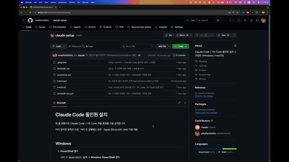
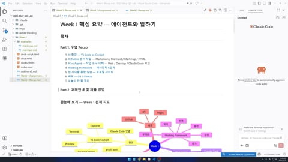

AI-native 워크샵 5월 코호트 학습 자료입니다.

&nbsp;

## 학습 자료

### Week 0 — Claude Code 환경 설치
- [설치 가이드 (이 문서 아래)](#week-0--claude-code-설치-가이드) — Windows / macOS 한 줄 설치
- [[NEW] CC로 클로드 실행](Week0-Claude-Setup/README.md) — 한 글자로 Claude Code 실행
- [[VOD]설치 가이드.mp4](https://vimeo.com/1190400755) <br> [](https://vimeo.com/1190400755)

### Week 1 — Foundation: 에이전트와 일하기
- [수업 덱](https://whatfontisthis.github.io/2026-May-QO-Lab/Week1-Foundation/deckv2.html)
- [요약 노트](https://whatfontisthis.github.io/2026-May-QO-Lab/Week1-Foundation/Week1-Recap.html)
- [과제 안내서](https://whatfontisthis.github.io/2026-May-QO-Lab/Week1-Foundation/Week1-Assignment)
- [[VOD]1주차 수업 리뷰 및 과제 안내 (23분부터).mp4](https://vimeo.com/1190869915) <br> [](https://vimeo.com/1190869915)

### Week 2 — Tools: CLAUDE.md · 서브에이전트 · 스킬 · MCP
- [수업 덱](https://whatfontisthis.github.io/2026-May-QO-Lab/Week2-Skilling/slides-week2.html)
- [[VOD]2주차 예습 영상.mp4](https://vimeo.com/1192167889) <br> [](https://vimeo.com/1192167889)

&nbsp;

<br><br><br><br><br><br>

---

# Week 0 — Claude Code 설치 가이드

한 줄 명령어로 Claude Code + VS Code 개발 환경을 자동 설치합니다.

이미 설치된 항목은 스킵 · 여러 번 실행해도 안전 · Apple Silicon(M1~M4) 자동 대응

&nbsp;

## Windows

1. **PowerShell 열기**

    시작 → `powershell` 입력 → **Windows PowerShell** 클릭

2. **스크립트 실행**

    아래 카드를 복사한 뒤 PowerShell 창에 우클릭으로 붙여넣고 엔터.

    ```powershell
    irm https://raw.githubusercontent.com/whatfontisthis/claude-setup/main/install.ps1 | iex
    ```

    설치 도중 UAC 팝업이 뜨면 **"예"** 클릭.

3. **설치 진행 대기**

    `[1/8]`부터 `[8/8]`까지 자동 진행. 5~10분 소요.

4. **설치 확인**

    PowerShell 창을 완전히 닫고 새로 연 뒤, 아래를 한 줄씩 실행해 버전이 출력되는지 확인.

    ```powershell
    node --version
    python --version
    git --version
    gh --version
    claude --version
    code --version
    ```

&nbsp;

## macOS

1. **터미널 열기**

    `⌘ + Space` → `terminal` 입력 → 엔터

2. **스크립트 실행**

    아래 카드를 복사한 뒤 터미널에 `⌘ + V`로 붙여넣고 엔터.

    ```bash
    /bin/bash -c "$(curl -fsSL https://raw.githubusercontent.com/whatfontisthis/claude-setup/main/install.sh)"
    ```

    처음 설치하는 Mac이면 Xcode CLT 팝업이 뜸 → **"설치"** 클릭 (10~20분).

3. **설치 진행 대기**

    `[1/9]`부터 `[9/9]`까지 자동 진행.

4. **설치 확인**

    터미널을 `⌘ + Q`로 닫고 새로 연 뒤, 아래를 한 줄씩 실행.

    ```bash
    node --version
    python3 --version
    git --version
    gh --version
    claude --version
    code --version
    ```

&nbsp;

## 자주 겪는 문제

<details>
<summary>"이 시스템에서 스크립트를 실행할 수 없으므로..." (Windows)</summary>

```powershell
Set-ExecutionPolicy -ExecutionPolicy RemoteSigned -Scope CurrentUser -Force
```

위 명령어 실행 후 다시 시도.
</details>

<details>
<summary>"명령을 찾을 수 없습니다"</summary>

터미널/PowerShell 창을 완전히 닫고 새로 열기. 그래도 안 되면 컴퓨터 재시작.
</details>

<details>
<summary>VS Code의 code 명령만 안 잡힐 때</summary>

VS Code를 한 번 실행 → 새 터미널 열고 `code --version` 재시도.
</details>

<details>
<summary>같은 명령어 여러 번 실행해도 되나?</summary>

네. 이미 설치된 항목은 자동 스킵.
</details>

&nbsp;

## 설치되는 도구

| 도구 | 용도 |
|------|------|
| Scoop / Homebrew | 패키지 매니저 |
| Node.js | JavaScript 런타임 |
| Python 3 | Python 실행 환경 |
| Git | 버전 관리 |
| GitHub CLI (`gh`) | 깃허브 터미널 도구 |
| Claude Code | AI 코딩 도구 (본체) |
| VS Code | 코드 편집기 |
| VS Code 확장 + 설정 | 확장 8개 + 권장 설정 자동 적용 |

&nbsp;

## 설치 후 설정

### `cc` 별칭 설정

`cc` 명령으로 `claude --dangerously-skip-permissions`를 빠르게 실행하세요.

**Windows:**
```powershell
.\Week0-Claude-Setup\setup-cc-alias-windows.ps1
```

**macOS / Linux:**
```bash
./Week0-Claude-Setup/setup-cc-alias-mac.sh
```

설정 후 쉘을 다시 시작하고 `cc` 명령으로 테스트합니다.

더 많은 설정 옵션은 [Week0 설정 가이드](Week0-Claude-Setup/README.md)를 참고하세요.

&nbsp;

문의 · 버그: [Issues](https://github.com/whatfontisthis/claude-setup/issues)
