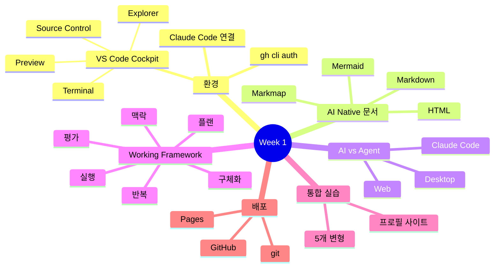
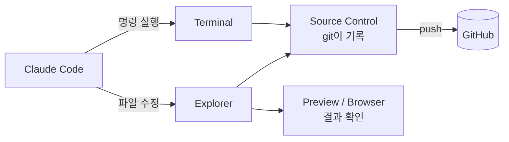
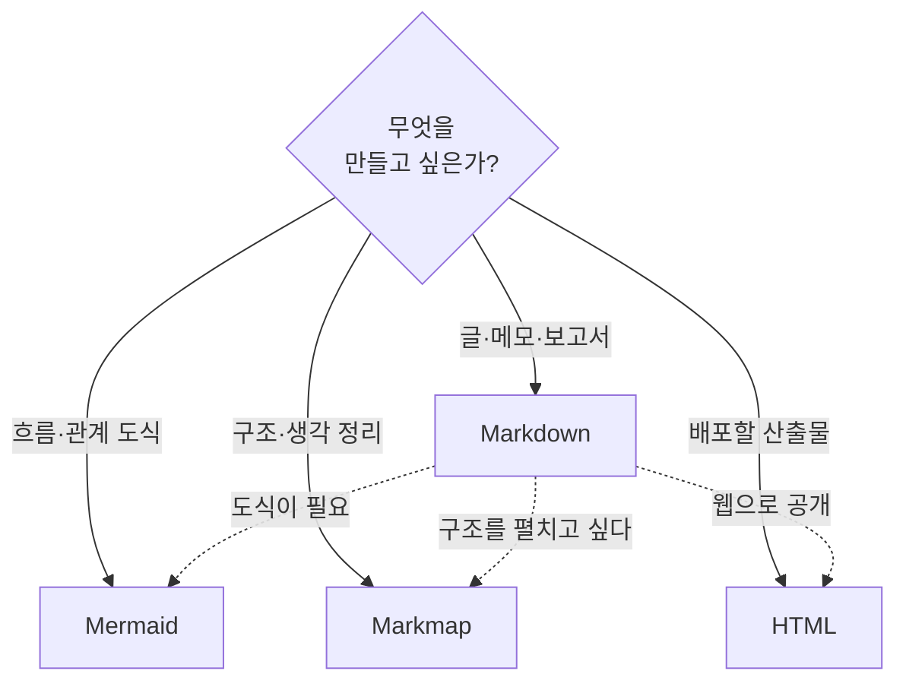
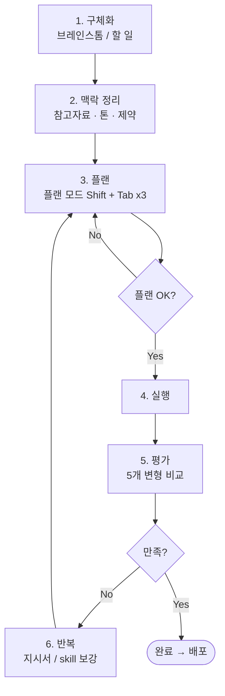

# Week 1 핵심 요약 — 에이전트와 일하기

## 목차

### Part 1. 수업 Recap
1. [AI 환경 — VS Code as Cockpit](#1-환경--vs-code-as-cockpit)
2. [AI Native 문서 작업](#2-ai-native-문서-작업) — Markdown / Mermaid / Markmap / HTML
3. [AI vs Agent — 작업 도구 이해](#3-ai-vs-agent--작업-도구-이해) — Web / Desktop / Claude Code 비교
4. [Working Framework — 에이전틱 6단계](#4-working-framework--에이전틱-6단계)
5. [한 사이클 통합 실습 — 프로필 사이트](#5-한-사이클-통합-실습--프로필-사이트)
6. [배포 — Git / GitHub](#6-배포--git--github)
7. [오늘의 한 줄 정리](#오늘의-한-줄-정리)

### Part 2. 과제안내 및 제출 방법

---

### 한눈에 보기 — Week 1 전체 지도

---

## 1. 우리의 AI환경 — VS Code as Cockpit

### 무엇을 했나
- Claude Code + VS Code 동작 체크
- 사전 과제 `claude-setup` 점검
- GitHub 가입 + `gh cli auth login`

### Cockpit 4공간
| 공간 | 역할 |
| --- | --- |
| Explorer | 파일과 폴더를 보는 공간 |
| Terminal | 명령을 실행하는 공간 |
| Preview / Browser | 산출물을 확인하는 공간 |

### Tip
- Claude Code는 "그 폴더 안에서" 실행돼야 그 폴더의 맥락을 인식한다

 

## 2. AI Native 문서 작업

### 왜 Word / PPT / HWP를 안 쓰는가
**AI가 잘 다루지 못하기 때문.**
사람용 도구가 아니라, AI가 잘 다루는 포맷에서 시작한다.
(예외: 최종 인쇄/제출용은 마지막에만 변환. 작업 중엔 절대 `.docx`로 가지 않는다.)

### Markdown
- AI도 잘 쓰고 사람도 보기 좋음
- 빠른 작업 / 확장에 유리
- VS Code Preview: `Ctrl/Cmd + Shift + V` (사이드: `Ctrl + K, V`)

### Mermaid
- md는 텍스트, 도표가 필요할 때 mermaid
- AI가 안정적으로 그리는 건: flowchart / sequence / gantt / mindmap

### Markmap
- mermaid mindmap을 펼쳐서 보여주는 extension
- **본인 머리 정리에 가장 유용** — 빈 가지가 한눈에 보임

### HTML as Artifact
- **Markdown은 원고, HTML은 산출물.**
- HTML은 브라우저만 있으면 열린다 → 웹으로 배포 가능
- 한 파일에 다 넣은 **single-file HTML**이 가장 다루기 쉬움

### 4가지 포맷, 언제 무엇을 쓰는가

---

## 3. AI vs Agent — 작업 도구 이해

### 개념
- **AI agent (교과서)**: 환경을 관찰하고, 판단하고, 행동하는 자율 주체
- **오늘날의 AI agent**: LLM이 두뇌, 도구가 손발. 자연어 지시를 받아 plan → 실행 → 평가를 스스로 반복.
- **달라진 것**: 좁은 환경·규칙 기반 → 자연어 인터페이스 + 파일·브라우저·API를 직접 다루며 다단계로 자율 실행가능.

### Web vs Desktop App vs Claude Code

| | Web | Desktop App | Claude Code |
| --- | --- | --- | --- |
| 파일 직접 조작 | — | 첨부만 (읽기) | **읽기 · 쓰기 · 생성** |
| 명령 실행 / 자동화 | — | — | **터미널 · git · 다단계 loop** |
| 프로젝트 맥락 | — | 대화 단위 | **폴더 단위로 유지** |
| 결과물 형태 | 응답 텍스트 | 응답 텍스트 | **실제 파일 · 커밋 · 배포** |
| 적합한 일 | 질문 · 초안 | 문서 분석 · 긴 대화 | **만들기 · 배포 · 리팩토링** |

**결정적 차이 — 사람이 복붙하는 단계가 사라진다.**
이 한 칸이 30분을 5분으로 줄인다.

### Claude Code 자주 쓰는 명령어
`/rewind` ·  `/context` · `/usage` · `Esc` (작업 중단) · `/login`

---

## 4. 에이전틱하게 일하는 프레임워크 6단계

### 프로젝트 시작하기
1. 내 컴퓨터에 새로운 폴더를 만든다
2. VS Code에서 ctrl/cmd+o로 폴더를 연다
3. AI와 시작한다

> **한 폴더 = 한 맥락**이 깨지지 않게.

### 6단계 프레임워크

### 단계별 예시 — "1페이지 프로필 사이트 만들기"

| 단계 | 학생이 하는 말 (예시) |
| --- | --- |
| **1. 구체화** | "내 1인 창업 랜딩 페이지를 만든다. 섹션은 소개·서비스·연락처 3개. 길이는 1페이지." |
| **2. 맥락 정리** | "톤은 미니멀, 컬러는 #111 / 흰색, 폰트는 sans-serif. 참고 사이트 A·B·C. 절대 쓰지 말 것: 이모지·드롭섀도·자동 슬라이더." |
| **3. 플랜** | "`Shift+Tab` 두 번 누르고 플랜만 먼저. 파일 목록, 내가 정해야 하는 옵션, 멈출 지점까지 같이 보여줘." |
| **4. 실행** | "OK. 플랜대로 `index.html` 만들어줘." |
| **5. 평가** | "같은 컨셉으로 5개 변형 만들어줘. 한 줄 설명도 같이." |
| **6. 반복** | "헤더 폰트가 너무 커. 24px로." → 그리고 "내 skill에 '헤더는 24px 기본' 한 줄 추가해줘." |

> 익숙해지면 1·2단계가 합쳐진다. 처음엔 무조건 분리해서 의식할 것.

---

## 5. 한 사이클 통합 실습 — 프로필 사이트 만들기

### 6단계 따라하기
1. **구체화** — 만들 사이트 1개 결정 (개인 프로필 사이트)
2. **폴더 만들기** — 빈 폴더 생성, VS Code · Claude Code로 열기
3. **맥락 작성** — 목적 · 톤 · 색상 · 참고 사이트를 한 메시지에 정리해 전달
4. **플랜 요청** — "어떻게 만들지 플랜부터 보여줘" (Shift + Tab 두 번)
5. **플랜 검토** — 어색한 부분 1~2개만 고치고 OK
6. **실행 + 확인** — 생성된 `.html`을 브라우저로 열어 첫 인상 체크

---

## 6. 배포 — Git / GitHub

### 개념 정리 — 사진첩 비유

내 컴퓨터에 작업 폴더가 하나 있다고 생각하자.
**git**은 그 폴더를 찍는 카메라, **GitHub**는 그 사진을 올리는 클라우드 앨범이다.

| 용어 | 쉽게 말하면 | 비유 |
| --- | --- | --- |
| **git** | 내 폴더 상태를 사진처럼 찍어두는 도구 | 카메라 |
| **로컬 리포 (local repository)** | git이 관리하는 내 폴더 | 내 휴대폰 안 |
| **깃헙 리포 (githubg repository)** | GitHub에 올라가 있는 내 폴더 | 앨범 1권 |
| **commit** | "지금 이 모습"으로 사진 한 장 찍기 | 사진 한 장 찍기 |
| **GitHub** | 그 사진들을 인터넷에 올려두는 곳 | 구글 포토 / 클라우드 앨범 |
| **push** | 내 컴퓨터(로컬)의 사진을 GitHub 리포로 올리기 | 사진 업로드 |
| **.gitignore** | "이 파일들은 절대 찍지 마/올리지 마" 목록 | 사진 찍지 말 것 (비밀번호·큰 파일 등) |

> 한 줄 요약 — **git으로 내 폴더 사진을 찍고, push로 GitHub에 올리고, Pages로 그 폴더를 웹페이지처럼 보여준다.**

### 클로드 코드에는 이렇게 말하면 된다

명령어를 외울 필요 없다. 자연어로 한 줄씩 부탁하면 클로드 코드가 알아서 해준다.

| 단계 | 클로드 코드에게 하는 말 | 뒤에서 일어나는 일 |
| --- | --- | --- |
| 1. 시작 | **"이 폴더 git으로 관리해줘"** | git 카메라 켜기 (`git init`) |
| 2. 저장 | **"지금까지 한 작업 커밋해줘"** | 사진 한 장 찍기 (`git add` · `git commit`) |
| 3. 업로드 | **"깃허브에 푸시해줘"** | 클라우드 앨범에 올리기 (`gh repo create` · `git push`) |
| 4. 배포 | **"Git Pages에 profile_site.html 배포해줘"** | 그 파일을 웹페이지로 공개 |

> 4단계가 끝나면 누구나 들어올 수 있는 공개 URL이 나온다.

### 한번에 배포

 
 
 

## Week1 한 줄 정리

> **도구를 배우는 게 아니라, AI 에이전트와 함께 일할 수 있는 시스템을 만들어 나간다.**
