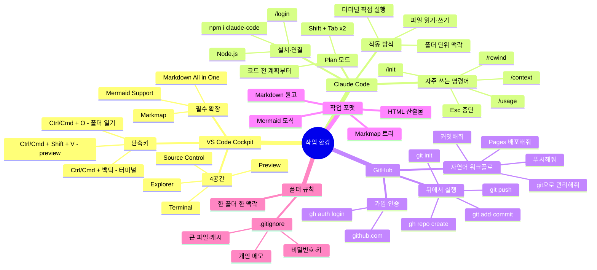

# 우리의 작업 환경 — 한눈에 보기

```mermaid
mindmap
  root((작업 환경))
    VS Code Cockpit
      4공간
        Explorer
        Terminal
        Source Control
        Preview
      필수 확장
        Markdown All in One
        Mermaid Support
        Markmap
      단축키
        Ctrl/Cmd + 백틱 - 터미널
        Ctrl/Cmd + Shift + V - preview
        Ctrl/Cmd + O - 폴더 열기
    Claude Code
      설치·연결
        Node.js
        npm i claude-code
        /login
      작동 방식
        폴더 단위 맥락
        파일 읽기·쓰기
        터미널 직접 실행
      자주 쓰는 명령어
        /init
        /context
        /rewind
        /usage
        Esc 중단
      Plan 모드
        Shift + Tab x2
        코드 전 계획부터
    GitHub
      가입·인증
        github.com
        gh auth login
      자연어 워크플로
        git으로 관리해줘
        커밋해줘
        푸시해줘
        Pages 배포해줘
      뒤에서 실행
        git init
        git add·commit
        gh repo create
        git push
    작업 포맷
      Markdown 원고
      Mermaid 도식
      Markmap 트리
      HTML 산출물
    폴더 규칙
      한 폴더 한 맥락
      .gitignore
        비밀번호·키
        큰 파일·캐시
        개인 메모
```
