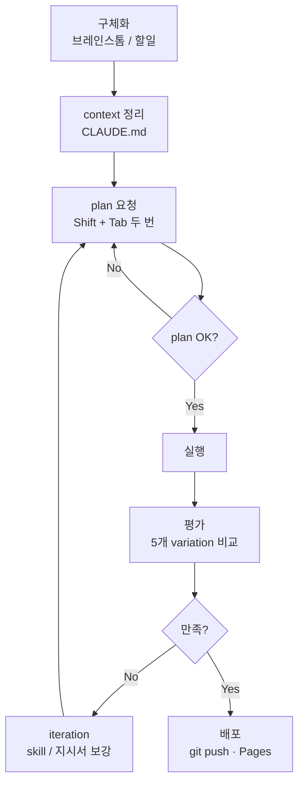
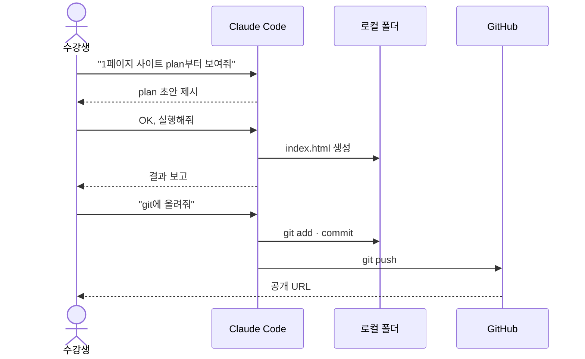
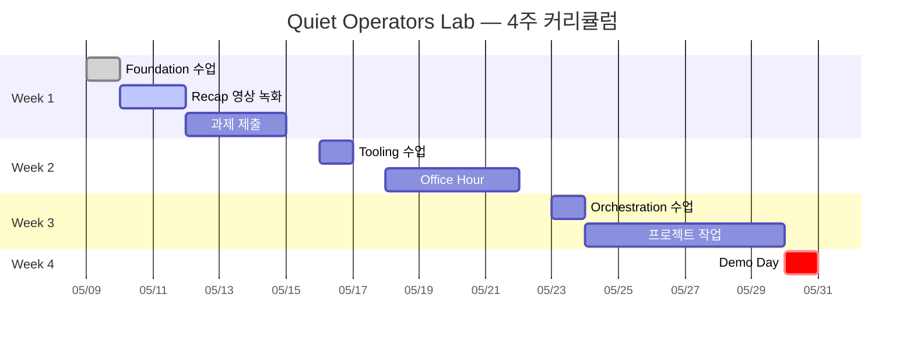
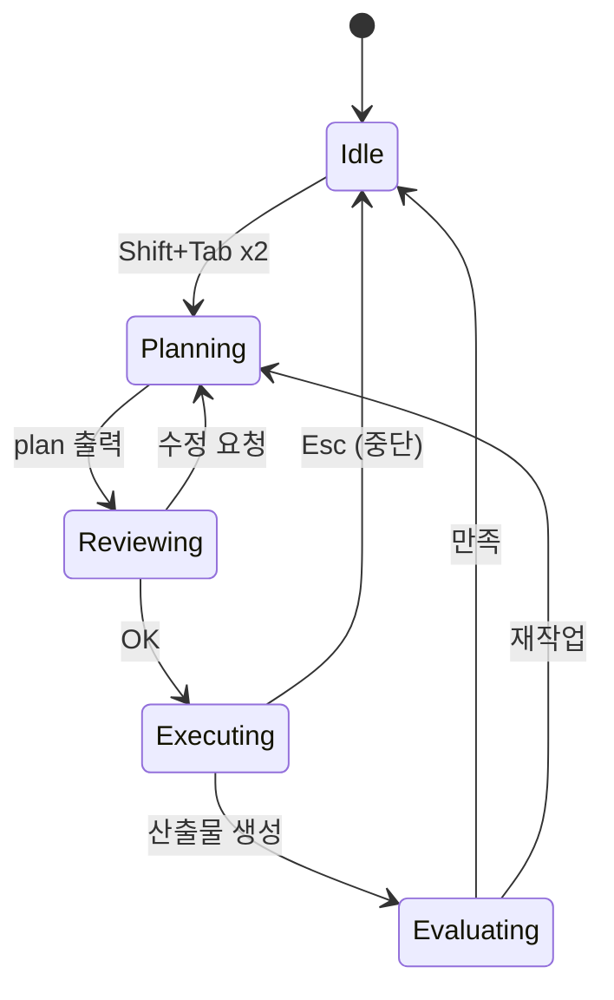

# Mermaid 예제 — 에이전틱 6단계 워크플로

> 텍스트로 그리는 도식. VS Code Mermaid extension 미리보기로 확인.
> 안정적으로 그려지는 타입: flowchart / sequence / gantt / mindmap.

---

## 1. Flowchart — 6단계 작업 흐름



---

## 2. Sequence — 사용자 ↔ Claude Code ↔ Git 흐름



---

## 3. Gantt — Week 1 ~ Week 4 일정



---

## 4. State diagram — Claude Code 작업 모드



---

## png로 저장하려면

Claude Code에 다음과 같이 요청:

```
이 mermaid 도식을 png로 저장해줘
```

같은 폴더에 `.png` 파일이 생성된다.
