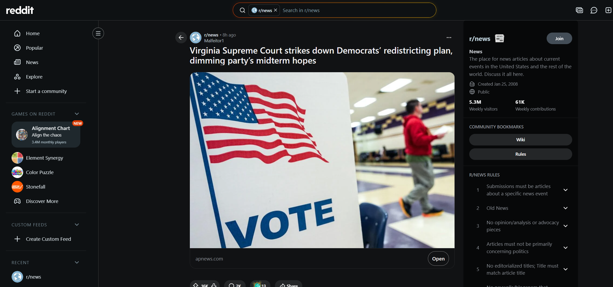
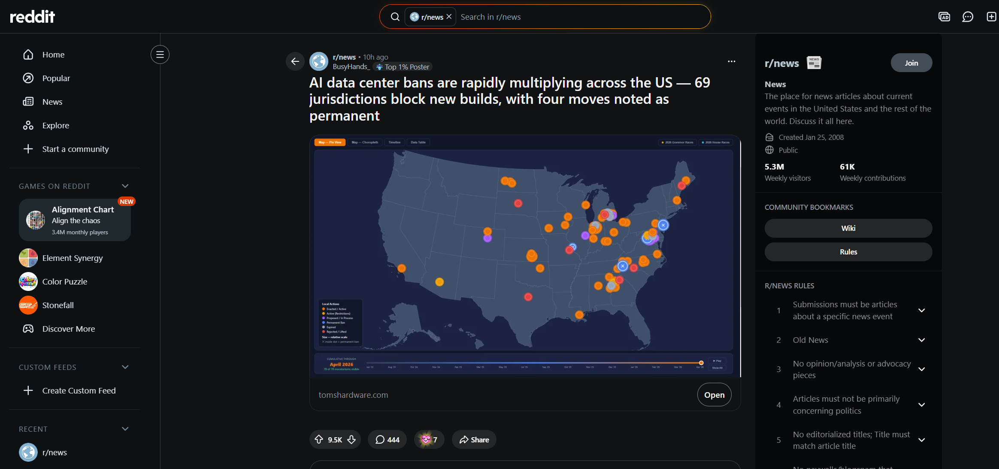
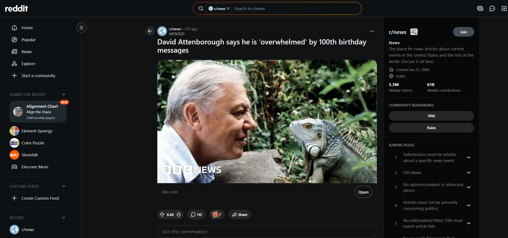
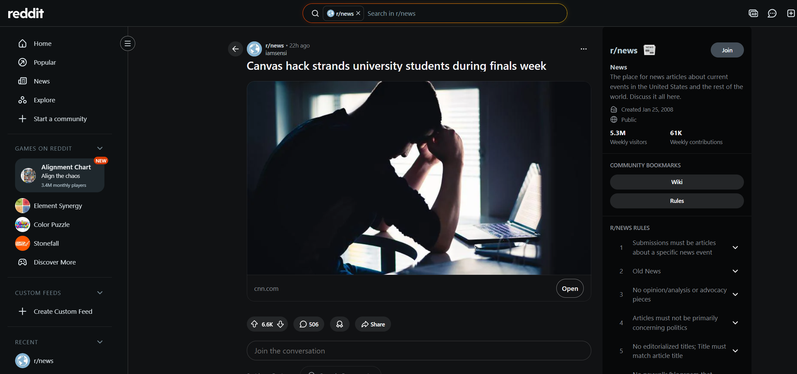
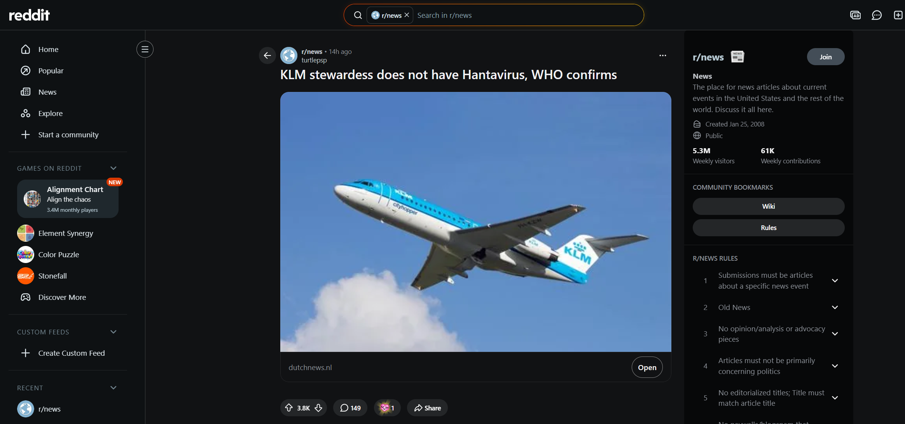

# Reddit r/news — Top Trending (2026-05-09)

출처: https://www.reddit.com/r/news/top/?t=day

---

## 1. Virginia Supreme Court strikes down Democrats' redistricting plan, dimming party's midterm hopes

- **Reddit:** https://www.reddit.com/r/news/comments/1t79jw4/virginia_supreme_court_strikes_down_democrats/
- **Source:** https://apnews.com/article/redistricting-virginia-congress-democrats-republicans-12a31037f3c9a94d3cb9fbcaaf84d94f
- **Upvotes:** ~16K · **Comments:** ~2K

---

## 2. AI data center bans are rapidly multiplying across the US — 69 jurisdictions block new builds, with four moves noted as permanent

- **Reddit:** https://www.reddit.com/r/news/comments/1t779rt/ai_data_center_bans_are_rapidly_multiplying/
- **Source:** https://www.tomshardware.com/tech-industry/artificial-intelligence/ai-data-center-bans-are-rapidly-multiplying-across-the-us-69-jurisdictions-block-new-builds-with-four-moves-noted-as-permanent
- **Upvotes:** ~9.5K · **Comments:** ~444

---

## 3. David Attenborough says he is 'overwhelmed' by 100th birthday messages

- **Reddit:** https://www.reddit.com/r/news/comments/1t6ypzs/david_attenborough_says_he_is_overwhelmed_by/
- **Source:** https://www.bbc.com/news/articles/cp3pww9g0p5o
- **Upvotes:** ~8.6K · **Comments:** ~110

---

## 4. Canvas hack strands university students during finals week

- **Reddit:** https://www.reddit.com/r/news/comments/1t6sqjl/canvas_hack_strands_university_students_during/
- **Source:** https://www.cnn.com/2026/05/07/us/canvas-hack-strands-college-students-finals-week

---

## 5. KLM stewardess does not have Hantavirus, WHO confirms

- **Reddit:** https://www.reddit.com/r/news/comments/1t71png/klm_stewardess_does_not_have_hantavirus_who/
- **Source:** https://www.dutchnews.nl/2026/05/klm-stewardess-does-not-have-hantavirus-who-confirms/

